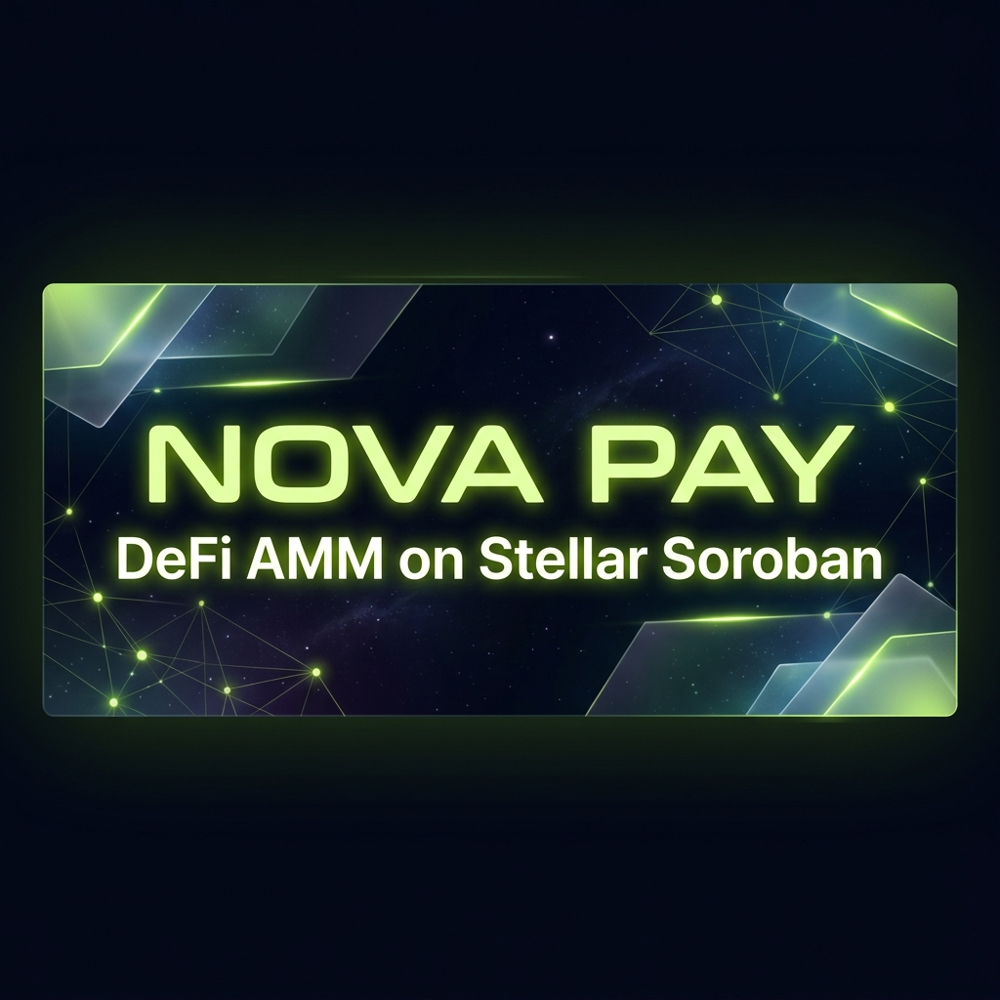
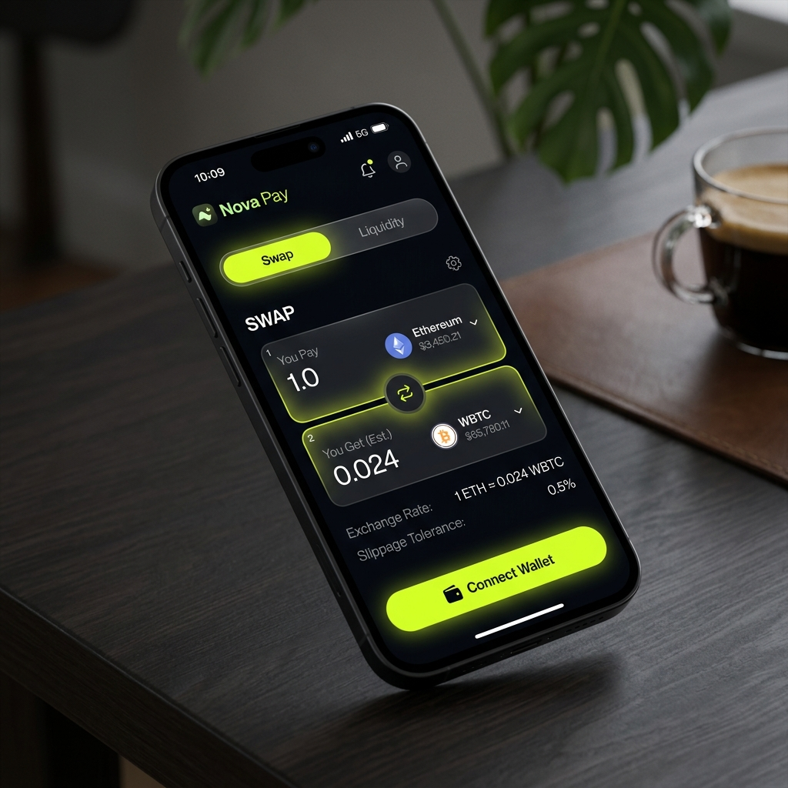

# ⚡ Nova Pay


> DeFi AMM on Stellar Soroban

## Live Demo
[https://sage-sunflower-dcad53.netlify.app/](https://sage-sunflower-dcad53.netlify.app/)


## Tech Stack
- Next.js 14 (App Router)
- TypeScript
- Stellar Soroban Smart Contracts (Rust)
- Freighter Wallet API
- SWR for real-time data polling

| Contract | Address | Link |
|---|---|---|
| Liquidity Pool | `CCQZXG3QGFPLRS6LJJ4XALJGUGVNLISYN6BJSVOH57ED6FYJH7KGKXAR` | [Stellar Expert](https://stellar.expert/explorer/testnet/contract/CCQZXG3QGFPLRS6LJJ4XALJGUGVNLISYN6BJSVOH57ED6FYJH7KGKXAR) |
| VOLT Token | `CCHLK4RHSS27U4K6VRIP6QW2N5IGBJJES4GA4CI3RRUGP54G4FH5HL7P` | [Stellar Expert](https://stellar.expert/explorer/testnet/contract/CCHLK4RHSS27U4K6VRIP6QW2N5IGBJJES4GA4CI3RRUGP54G4FH5HL7P) |
| Asset Wrapper | `CBMGE6BSHIGBXAUMW32D542POCBMI3DHP7ZZGI6RTGPRECJQA3S5ZFDI` | [Stellar Expert](https://stellar.expert/explorer/testnet/contract/CBMGE6BSHIGBXAUMW32D542POCBMI3DHP7ZZGI6RTGPRECJQA3S5ZFDI) |
| VOLT Issuer | `GBALPCSLWTTOVYUJ35KSDBOQETFDFAGKMQOYN76OWLY7QCIHLQUHINBS` | [Stellar Expert](https://stellar.expert/explorer/testnet/account/GBALPCSLWTTOVYUJ35KSDBOQETFDFAGKMQOYN76OWLY7QCIHLQUHINBS) |

## Screenshots



## CI/CD
GitHub Actions workflow runs on every push to main:
- **Smart Contracts:** Lints, tests, and builds Soroban Rust contracts (WASM).
- **Frontend:** Lints TypeScript and builds Next.js production bundle.
- **Verification:** Ensures full project integrity before deployment.

## Inter-Contract Calls
The `add_liquidity`, `remove_liquidity`, and `swap` functions within the **Liquidity Pool Smart Contract** automatically invoke the **Token Contract** via cross-contract calls `env.invoke_contract::<()>` for real-time asset transfers without requiring intermediate steps from the user. 
- **Transaction Hash Evidence:** `3715b5082121510444585f98826509f6df84643f8e658e390c50172e259e55e5` ([View on Stellar Expert](https://stellar.expert/explorer/testnet/tx/3715b5082121510444585f98826509f6df84643f8e658e390c50172e259e55e5))
## Custom Token & Pool
- VOLT Token deployed at: [`CCHLK4RHSS27U4K6VRIP6QW2N5IGBJJES4GA4CI3RRUGP54G4FH5HL7P`](https://stellar.expert/explorer/testnet/contract/CCHLK4RHSS27U4K6VRIP6QW2N5IGBJJES4GA4CI3RRUGP54G4FH5HL7P)
- Liquidity Pool deployed at: [`CCQZXG3QGFPLRS6LJJ4XALJGUGVNLISYN6BJSVOH57ED6FYJH7KGKXAR`](https://stellar.expert/explorer/testnet/contract/CCQZXG3QGFPLRS6LJJ4XALJGUGVNLISYN6BJSVOH57ED6FYJH7KGKXAR)

## Local Development
To get started locally, follow these steps:
1. Clone the repository and navigate to the root directory.
2. Ensure you have Node.js and npm installed.
3. Install dependencies:
   ```bash
   npm install
   cd frontend && npm install
   ```
4. Set up your `.env.local` inside the `frontend` directory with required environment variables.
5. Run the development server:
   ```bash
   npm run dev
   ```

## License
MIT
